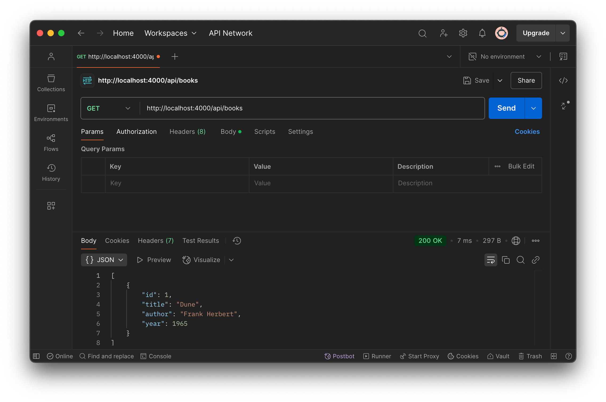
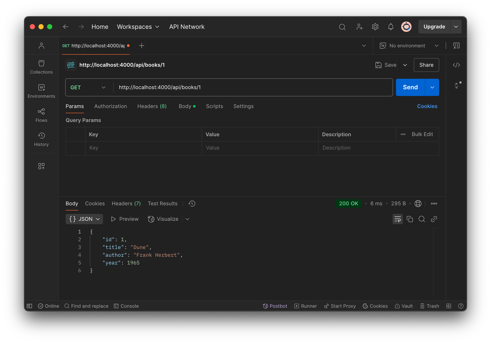
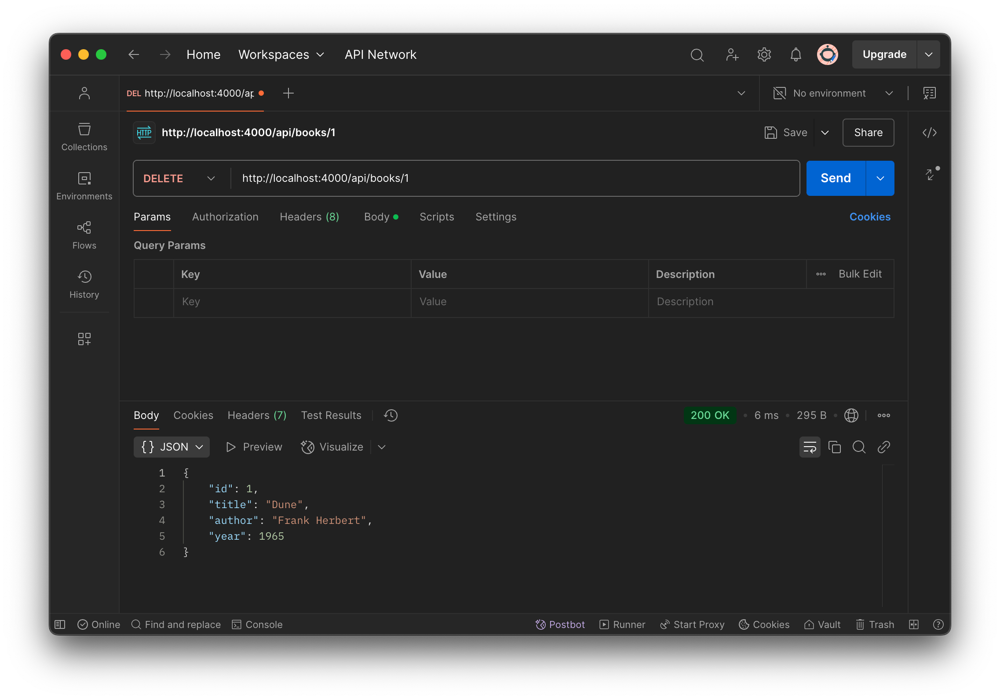

# Book API

Лабораторна 1

## 🚀 Запуск проєкту

### 1️⃣ Встановлення залежностей

```sh
npm install
```

### 2️⃣ Запуск сервера

Щоб запустити API, виконайте команду:

```sh
npm run dev
```

Сервер запуститься на порту `4000`.

```sh
http://localhost:4000/api/books
```

## 🔥 Тестування API

### 1️⃣ Отримати всі книги

**Метод:** `GET`

```sh
http://localhost:4000/api/books
```



---

### 2️⃣ Отримати книгу за ID

**Метод:** `GET`


---

### 3️⃣ Додати книгу

**Метод:** `POST`


---

### 4️⃣ Видалити книгу

**Метод:** `DELETE`


---
